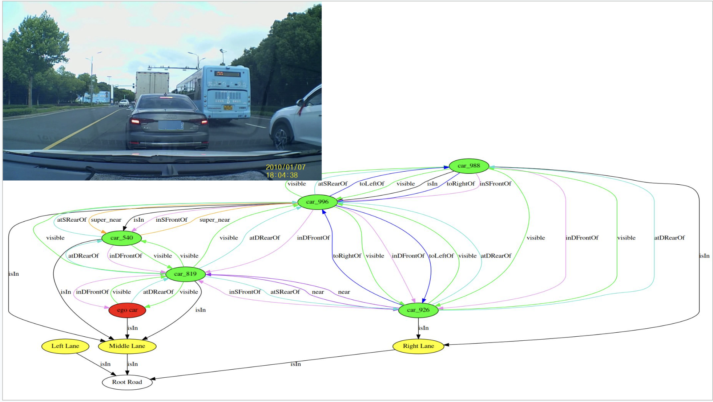

# Abstract
Traffic cognition is a critical problem requiring perceiving, understanding, and interpreting traffic-related information and events without context. This requires identifying elements of the traffic environment such as vehicles, pedestrians, roads, traffic signals, and miscellaneous infrastructure.

This problem not only helps us understand traffic interaction and behaviors over time and space but also finds applications in intelligent transportation systems, autonomous vehicles, and assisted driving technologies. Understanding these behaviors helps the system to make informed decisions, predict future events, and respond to changing traffic conditions in real-time.

# Problem Statement
The current state-of-the-art techniques generally include using transformer and attention based models including ViT and Visual BERT to extract features from the image / video. Also, questions are processed using similar architectures. These modalities are fused using a myriad of fusion techniques and are fed to a fully connected neural network to predict the output. However, the major limitation of these models is that they are not able to represent the semantic relationship between the images and questions easily. Hence, a key challenge in VQA is to require a joint reasoning over visual and textual domains. As a result, graph based methods are increasingly becoming popular because they are able to represent these semantic relationships easily and lower the computational cost significantly compared to the other complex models.

The main aim of the paper is to apply various graph based methods / models to the domain of traffic cognition to aid in the direction of interpreting traffic-related information in using graph based methods including and is not limited to graph neural networks or scene graphs or knowledge graphs based reasoning. The objective of this is to achieve real-time SOTA performance with lower computational cost. To the best of our knowledge, this is the first time anyone has applied graph based methods to traffic analysis.

# Example

# Architecture
> Architecture Overview

> Scene Graph

> Graph VQA
